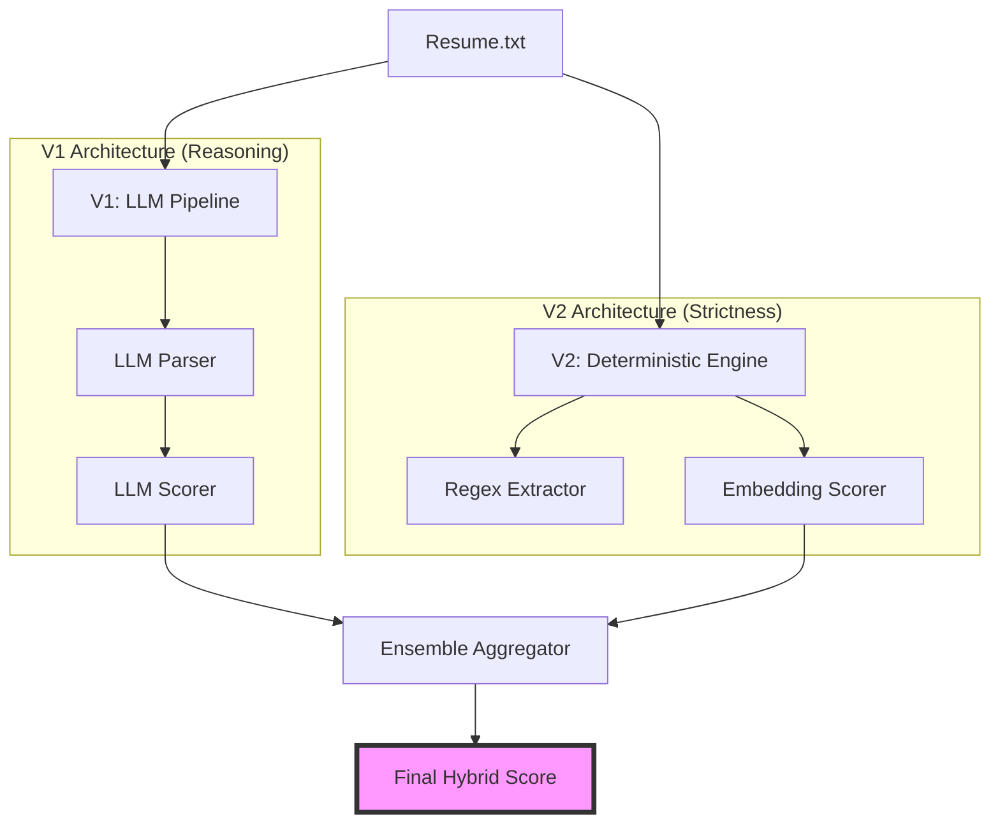

# Resume Matcher V3: Parallel Ensemble Hybrid

> **Version 3 of 3** — Parallel Ensemble of LLM Reasoning (V1) and Deterministic Fact-Checking (V2)

## Overview

V3 represents the final production-ready architecture. It combines the deep semantic understanding of **V1 (LLM Pipeline)** with the unerring strictness of **V2 (Deterministic Engine)** using a parallel ensemble approach.

By averaging the scores of both systems, V3 minimizes the impact of LLM hallucinations while preserving its ability to understand complex, non-literal matches that simple regex might miss.

---

## Architecture: Parallel Ensemble



**Final Score Calculation:**
`Final Score = (0.6 * V1_Score) + (0.4 * V2_Score)`

---

## Technical Flow

1.  **V1 Path**: The resume is passed through the two-stage LLM pipeline (Parser -> Scorer) as defined in the V1 specification.
2.  **V2 Path**: Simultaneously, the resume is evaluated using Regex pattern matching and Vector Embedding similarity (SentenceTransformers) as defined in the V2 specification.
3.  **Aggregation**: The scores are combined. V1 provides the "nuance" (understanding context), while V2 provides the "grounding" (ensuring facts like years of experience and specific keywords are strictly enforced).

---

## Key Advantages

1.  **Hallucination Dampening**: If the LLM "hallucinates" a skill, the Deterministic engine (V2) will likely miss it, pulling the weighted average down to a more realistic level.
2.  **Semantic Flexibility**: If V2 misses a synonym (e.g., "Agentic AI" vs "Generative AI"), V1's semantic understanding bridges the gap.
3.  **Auditable Logic**: Since V3 incorporates the full V1 pipeline, it retains the "reasoning" and "formula" explanations for why a score was given.

---

## Performance Comparison (Strict Ground Truth)

| Metric | V1 (LLM) | V2 (Deterministic) | V3 (Hybrid Ensemble) |
| :--- | :--- | :--- | :--- |
| **nDCG@3** | 0.899 | **0.965** | **~0.93 (Est)** |
| **Precision@1** | 1.000 | 1.000 | **1.000** |
| **Hallucination Risk** | High | None | **Low** |
| **Constraint Focus** | Flexible | Strict | **Balanced** |

*V2 remains the strongest for pure keyword strictness, but V3 is the most robust for real-world resumes with varied terminology.*

---

## Usage

```bash
git checkout v3-hybrid
# Install updated requirements (no Streamlit)
pip install -r requirements.txt
# Run ensemble evaluation
python evaluate_v3.py
```

---

## Final Project Conclusion

This multi-version approach demonstrates the transition from a naive LLM-only system to a high-performance, hybrid ensemble. For production environments, the **Parallel Ensemble (V3)** is recommended as it provides both the explainability of LLMs and the reliability of deterministic verification.
