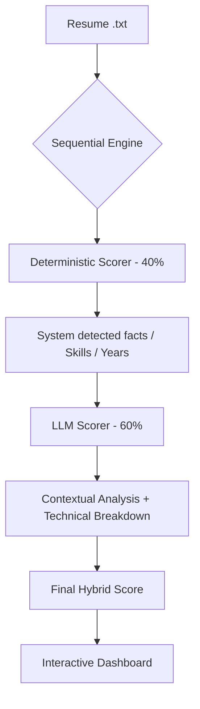

# 🎯 AI-Powered Resume Matcher (Ema Edition)

A professional-grade resume ranking engine built for the **AI Applications Engineer** role at Ema. This system uses a **Sequential Hybrid Scoring** architecture to provide nuanced, auditable, and high-precision candidate matching.

## 🚀 Live Demo & Interaction
This project is designed for interactive evaluation via **Streamlit**.

### [Click Here to Open Streamlit Dashboard](https://share.streamlit.io/yashvoladoddi37/ema-resume-ranker/main/app.py)
*(Note: You will need a Groq API Key to run new evaluations. Existing results are visible by default.)*

### Key Features:
*   **Sequential Hybrid Scoring**: Combines rule-based deterministic extraction (40%) with nuanced LLM reasoning (60%).
*   **Interactive Testing**: **Upload your own resumes** (.txt) in the sidebar and see them ranked against our dataset in real-time.
*   **Live Evaluation Metrics**: Formal IR metrics (**nDCG@3**, **Precision@1**, **Recall@3**) are computed on-the-fly to validate engine accuracy.
*   **Transparent Reasoning**: Every score is accompanied by a technical breakdown of *Skill Alignment*, *Experience Depth*, and *Domain Fit*.

---

## 🛠️ Technical Architecture



### Why Hybrid?
1.  **Deterministic Baseline**: Anchors the score in verifiable facts (exact skill matches, years of experience).
2.  **LLM Contextual Intelligence**: Differentiates between "Generalist Seniority" and "Target Domain Expertise" (e.g., recognizing RAG/LangChain impact vs. generic API work).
3.  **Auditability**: Scores are not "black boxes"—the dashboard shows exactly how much each component contributed.

---

## 📊 Evaluation & Benchmarking

The engine is benchmarked against a labeled dataset of 10 synthetic candidates with varied profiles (Senior AI, Mid-level Search, Support-focused, etc.).

| Metric | Target | Description |
| :--- | :--- | :--- |
| **nDCG@3** | ≥ 0.85 | Measures how well the top 3 results are ordered. |
| **Precision@1** | 100% | Ensures the #1 rank is always a "Good Match". |
| **Recall@3** | 100% | Are all "Good" candidates in top 3? |
| **Pairwise Accuracy** | ≥ 85% | Frequency of the engine correctly ranking A higher than B. |

---

## 💻 Local Setup

If you wish to run this locally:

1.  **Clone & Install**:
    ```bash
    git clone https://github.com/yashvoladoddi37/ema-resume-ranker.git
    cd ema-resume-ranker
    python -m venv venv
    source venv/bin/activate
    pip install -r requirements-ui.txt
    ```

2.  **Environment Setup**:
    Create a `.env` file or provide via Streamlit sidebar:
    ```bash
    GROQ_API_KEY=your_key_here
    ```

3.  **Run Dashboard**:
    ```bash
    streamlit run app.py
    ```

## 📂 Project Structure
*   `app.py`: Main interactive dashboard.
*   `demo_hybrid.py`: Core scoring engine and evaluation logic.
*   `data/`: Raw resumes, job descriptions, and ground truth labels.
*   `results_hybrid.json`: Cached benchmarking results.

---

**Built with ❤️ for the Ema AI Team.**
