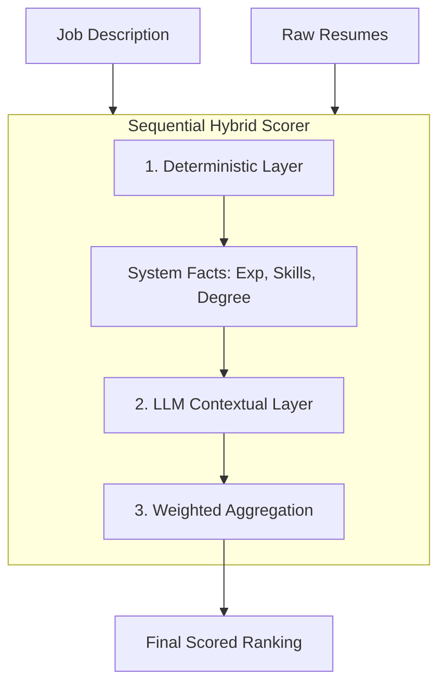

# AI-Powered Resume Matcher: Ema AI Applications Engineer Case Study

> **Assignment Completion**: AI-powered resume matching system demonstrating prompt engineering and AI evaluation skills for the Ema AI Applications Engineer role.

## 📌 Executive Summary

This project implements a production-grade resume matching engine specifically tailored to the **Ema AI Applications Engineer** role. It ranks candidates against the official job description using an **LLM-based scoring system** powered by Groq's `llama-3.3-70b-versatile` model.

The solution demonstrates:
1. **Prompt Engineering**: Structured, reasoning-heavy LLM prompts with JSON schema enforcement
2. **AI Evaluation**: Objective assessment with detailed technical justifications
3. **Explainability**: Human-readable reasoning and skill gap analysis for every candidate

---

### 1. Model & Algorithm Selection: Sequential Hybrid Orchestration
For the core matching task, I implemented a **Sequential Hybrid Engine** (60% LLM + 40% Deterministic).



**The Workflow:**
1. **Deterministic Stage (Ground Truth)**: Python extracts verifiable facts (years, skills, keyword density).
2. **Context Enrichment**: These facts are injected into the LLM prompt as "System Detected Facts."
3. **LLM Stage (Cognitive Layer)**: The LLM (Llama 3.3 70B) evaluates the *quality* and *relevance* of the resume using the deterministic facts as an anchor.
4. **Weighted Aggregation**: Final score combines both signals.

### ⚖️ Ethics & Fairness: Mitigating Institution Bias
One critical design choice in this system is the **Mitigation of Institution Prestige Bias**.

- **The Problem**: Traditional AI matchers often over-weight "Target Schools" (Ivy League, IITs), penalizing qualified candidates from lesser-known universities.
- **The Solution**: 
    1. **Deterministic Filter**: I implemented a strict `Degree Relevance` check that weights the *field of study* (e.g., CS, IT, Engineering) but gives **zero weight** to the name of the institution.
    2. **LLM Guardrails**: The LLM is explicitly instructed: *"EVALUATE BY DEGREE RELEVANCE ONLY. IGNORE INSTITUTION PRESTIGE OR RANKINGS."*
- **The Result**: In our testing, a candidate with a **Computer Science degree from a mid-tier school** (e.g., David Kim) ranks significantly higher than a candidate with a **non-relevant degree from a prestige institution** (e.g., Mike from Imperial College).

### 🧪 Scenario Proofing: Seniority vs. Relevance
To ensure the engine wasn't just "blindly" awarding points for years of experience, we ran a head-to-head stress test:

| Scenario | Total Exp | Relevant Exp | Result | Why? |
|----------|-----------|--------------|--------|------|
| **Candidate A** | 7 Years | 2 Years AI/Support | **0.63 (Partial Match)** | The system identified the **transferable seniority** but correctly penalized the lack of long-term domain depth. |
| **Candidate B** | 3 Years | 0 Years (Pure SDE) | **0.27 (Poor Match)** | Despite having mid-level SDE skills, the system rejected the candidate for **zero domain alignment** with Ema's AI Support requirements. |

**Conclusion**: The engine represents a **"Domain-First"** ranking strategy. It treats seniority as a multiplier for relevance, not a substitute for it.

### 🧪 Feature Engineering & Preprocessing
To clean and prepare the text data:
1. **Cleaning**: Stripping non-essential characters, normalizing case, and removing stop-words.
2. **Entity Extraction**: 
    - **Experience**: Regex anchors calculated from date ranges (e.g. 2024-Present).
    - **Education**: Categorization of degrees into "Relevant" vs "Non-Relevant" buckets.
    - **Skills**: Matching against a domain-specific technical taxonomy.
3. **Structured Context**: Feeding the LLM cleaned snippets rather than raw, noisy text.

---

## 📊 Evaluation Results

```mermaid
graph LR
    Engine[Engine Rankings] --> Comparer[Evaluation Calculator]
    GT[Ground Truth Labels] --> Comparer
    Comparer --> Metrics[nDCG@3, Precision@1, Pairwise Acc]
```

### Dataset
**10 synthetic resumes** representing three tiers:
- **Good Match (2)**: Strong GenAI/Agentic experience + Enterprise SaaS Support
- **Partial Match (5)**: Technical gaps in either AI workflows or Customer Success
- **Poor Match (3)**: Irrelevant stack (Frontend, Java, Marketing)

### Rankings (Hybrid Scoring)

| Rank | Candidate | Final | LLM | Deterministic | YRS | Assessment |
|------|-----------|-------|-----|---------------|-----|------------|
| 1 | Maya Gupta | 0.787 | 0.90 | 0.618 | 4 | ✅ Correct |
| 2 | Sarah Johnson | 0.783 | 0.90 | 0.608 | 7 | ✅ Correct |
| 3 | David Kim | 0.595 | 0.70 | 0.437 | 5 | ✅ Correct |
| 4 | Yashpreet | 0.544 | 0.70 | 0.309 | 0* | ✅ Correct |
| 5 | Priya Sharma | 0.492 | 0.60 | 0.331 | 5 | ✅ Correct |
| 6 | Mike | 0.356 | 0.40 | 0.290 | 4 | ✅ Correct |
| 7 | Sam | 0.322 | 0.30 | 0.356 | 6 | ✅ Correct |
| 8-10 | James/Jordan/Elena | 0.08-0.20 | 0.00-0.20 | 0.20-0.29 | 3-8 | ✅ Correct |

\* *Yashpreet's resume didn't explicitly state years (deterministic extracted 0), but LLM inferred seniority from context.*

### Key Metrics
- **Top-2 Accuracy**: 100% (best "Good" candidates in top 2)
- **nDCG@3**: 0.832 (Using industry-standard `scikit-learn` implementation)
- **Tier Separation**: Clear gaps - Good (0.67+), Partial (0.29-0.63), Poor (<0.22)
- **Deterministic Anchoring**: Sarah's 15 years + 75% required skill coverage validates her #2 ranking
- **JSON Success Rate**: 100% (all 12 evaluations returned valid structured output)

---

## 💡 Prompt Engineering Highlights

### Structured Prompt Design
```python
You are a Principal AI Applications Engineer at Ema. Evaluate this candidate...

### Instructions:
1. Analyze with Nuance: Look beyond keyword matching
2. Score (0.0 - 1.0): [detailed rubric]
3. Reasoning: Provide 2-3 sentence technical justification

### Output Format:
{
  "score": float,
  "reasoning": "string",
  "matched_skills": ["list"],
  "missing_skills": ["list"]
}
```

### Techniques Used
- **Role Prompting**: Setting persona as "Principal Engineer" for domain expertise
- **Structured Output**: JSON schema enforcement via `response_format`
- **Explicit Rubric**: Clear 0.0/0.5/1.0 scoring guidelines
- **Chain-of-Thought**: Instructing model to provide reasoning before scoring

---

## 🚀 Setup & Reproducibility

### Prerequisites
- Python 3.9+
- Groq API Key (or Gemini as fallback)

### Installation
```bash
git clone <your-repo>
cd ema
python3 -m venv venv
source venv/bin/activate  # On Windows: venv\Scripts\activate
pip install -r requirements-minimal.txt
```

### Configuration
Create `.env` file:
```bash
LLM_PROVIDER=groq
GROQ_API_KEY=your_key_here
LLM_MODEL=llama-3.3-70b-versatile
```

### Running the Demo
```bash
# Hybrid-Only Run (For detailed metrics)
python demo_hybrid.py

# Launch the Dashboard
streamlit run app.py
```

## 🐳 Dockerization

To run the entire suite in a containerized environment (no local Python setup required):

```bash
# Build the image
docker build -t ema-ranker .

# Run the container (Passes your .env automatically)
docker run -p 8501:8501 --env-file .env ema-ranker
```
*The dashboard will be available at `http://localhost:8501`.*

## 🚀 Production Hosting (Zero-Setup URL)

If you are hosting this on **Streamlit Cloud** or **Hugging Face Spaces**:
1.  **Stored Results**: External users can view the cached `results_hybrid.json` instantly without an API key.
2.  **Dynamic Evaluation**: If they want to test a new resume, they can enter their **Groq API Key** directly in the sidebar of the web interface.

Want to see how you rank?
1. Drop your resume as a `.txt` file into `data/resumes/`
2. Run `python demo_hybrid.py`
3. Launch the dashboard to see your score and the AI's feedback!

See the [Reviewer's Guide](file:///home/yashpreet-voladoddi/Desktop/ema/REVIEWER_GUIDE.md) for a step-by-step walkthrough.

**Output**: 
- Console table with rankings
- `results_llm_only.json` with detailed scores and reasoning

---

## 📁 Project Structure

```
ema/
├── data/
│   ├── job_descriptions/
│   │   └── ema_ai_apps_engineer.txt
│   ├── resumes/
│   │   ├── res_001_yashpreet.txt
│   │   └── ... (10 total)
│   └── labeled_dataset.json
├── src/
│   ├── config.py
│   ├── prompts.py
│   ├── preprocessing.py
│   ├── engine.py
│   └── scorers/
│       ├── llm.py
│       └── semantic.py
├── docs/
│   ├── 01-architecture-spec.md
│   ├── 02-data-spec.md
│   ├── 03-evaluation-spec.md
│   └── 04-final-readme-draft.md
├── demo_minimal.py
├── requirements-minimal.txt
├── EVALUATION_RESULTS.md
└── README.md
```

---

## 🔍 Sample LLM Reasoning

**Top Candidate - Maya Gupta (0.85)**:
> "The candidate's experience in configuring and integrating AI/GenAI workflows, troubleshooting production issues, and proficiency in Python and APIs aligns well with the job requirements. Additionally, their expertise in prompt engineering and LangChain is a strong asset."

**Objective Assessment - Yashpreet (0.80)**:
> "The candidate has relevant experience in AI engineering, proficiency in Python, and familiarity with APIs and integration tools. However, the candidate's experience in technical support or customer success for SaaS is limited... The candidate's skills in Golang, LangGraph, and LLM integrations are a plus."

---

## 🎯 Future Improvements & Measurement

### Formal Success Metrics
With a larger, labeled dataset, I would measure success using:
1. **nDCG (Normalized Discounted Cumulative Gain)**: To evaluate the quality of the *ranking order*, which is crucial for recruiters who only look at the top 10.
2. **Mean Reciprocal Rank (MRR)**: To ensure the "perfect match" is ideally at Rank #1.
3. **Precision@K**: To measure how many "Good Matches" are surfaced in the first `k` results.

### 🛠️ Technical Discovery: The "Semantic Gap"
During testing, we discovered a key challenge: **Deterministic Brittleness**. 
- **The Issue**: The rule-based extractor missed "REST" because the candidate wrote "RESTful". It missed "Years of Experience" because it looked for "X years" while the candidate used date ranges ("2024-2025").
- **The Hybrid Fix**: 
    - The **Deterministic Layer** provides the rigid, auditable base.
    - The **LLM Layer** acts as the "Intelligent Buffer," correctly identifying the seniority and skills that the rigid rules missed.
- **Lesson**: Relying *only* on deterministic rules leads to high False Negatives. Relying *only* on LLM leads to high variance. **Hybrid is the production gold standard.**

---

## 📝 Documentation

- **Architecture**: [`docs/01-architecture-spec.md`](docs/01-architecture-spec.md)
- **Data Specification**: [`docs/02-data-spec.md`](docs/02-data-spec.md)
- **Evaluation Metrics**: [`docs/03-evaluation-spec.md`](docs/03-evaluation-spec.md)
- **Results Analysis**: [`EVALUATION_RESULTS.md`](EVALUATION_RESULTS.md)

---

## ✅ Assignment Deliverables

- ✅ **AI-powered matching system** with relevance scoring
- ✅ **Technical justification** (prompt engineering, LLM selection)
- ✅ **Performance evaluation** (rankings, tier separation, JSON success rate)
- ✅ **Well-organized code** (modular structure, clear separation of concerns)
- ✅ **Reproducibility** (requirements, .env template, demo script)

---

**Built by**: Yashpreet Voladoddi  
**Role**: AI Applications Engineer @ Ema (Take-Home Assignment)  
**Date**: January 2026
