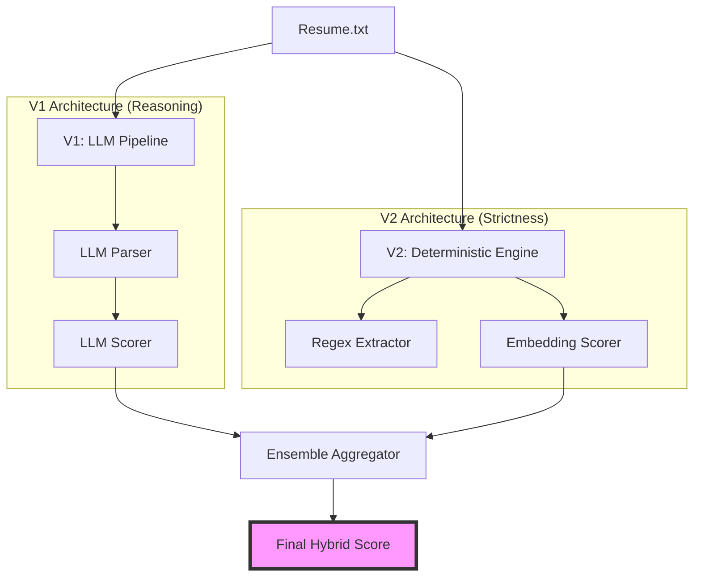

# Resume Matcher V3: Parallel Ensemble Hybrid

> **Version 3 of 3** — Parallel Ensemble of LLM Reasoning (V1) and Deterministic Fact-Checking (V2)

## Overview
The **Resume Matcher** is an AI-powered proof-of-concept designed to automatically score and rank resumes against a job description (JD). This V3 release represents the final production-ready architecture, using a parallel ensemble approach to balance deep semantic understanding with strict keyword verification.

---

## 1. Problem Formulation

### Business Problem
**Context**: The Talent Acquisition team currently relies on a manual resume screening process.
**Pain Points**:
- **Inefficiency**: The process is slow and resource-intensive.
- **Inconsistency**: Human review is prone to fatigue and bias.
- **Missed Opportunities**: Qualified candidates may be overlooked due to the sheer volume of applicants.
- **Goal**: Develop a prototype to automate independent fit scoring, allowing recruiters to focus only on top-ranked candidates.

### ML Problem Formulation
We formulate this as an **Information Retrieval (IR)** problem, specifically **Ranking**.

*   **Why not Classification?** The goal isn't just to make a binary "Hire/No Hire" decision. "Good fit" is a continuous spectrum relative to a specific Job Description (JD). Classification would also require a massive, balanced dataset of historical "Hired" vs "Rejected" profiles for *this specific role*, which we do not have.
*   **Why IR (Ranking)?** The core task is to retrieve the most relevant documents (resumes) given a query (JD) and order them by relevance.
*   **Assumptions**:
    *   **Recruiter Behavior**: Recruiters likely restrict their detailed reading time to the top $K$ candidates. Therefore, correctness at the top of the list is far more critical than correctness at the bottom.
    *   **Proxy for Quality**: We assume the semantic similarity and keyword coverage between a resume and a JD is a strong proxy for candidate quality.

---

## 2. Metrics

Given the IR formulation, we use ranking-aware metrics rather than simple accuracy.

*   **nDCG@k (Normalized Discounted Cumulative Gain)**
    *   **Why**: nDCG credits the model for placing highly relevant documents at the top of the list. It penalizes the model heavily if a "Perfect Match" is ranked lower than a "Poor Match". This aligns perfectly with the business need to surface the best talent first.
*   **Precision@k (P@k)**
    *   **Why**: Measurement of the utility of the shortlist. If a recruiter only looks at the top 3 candidates, how many were actually good matches?
*   **Recall@k**
    *   **Why**: Ensuring we don't miss any "Good Matches" in our top $K$ set.

---

## 3. Architecture & Methodology

To address the business requirements of efficiency and auditing, we hypothesized that a single approach (LLM or Deterministic) would be insufficient.

### Baselines
*   **Baseline A: Recursive Regex & Keywords (V2)**
    *   *Pros*: Extremely fast, zero hallucinations, perfect for checking hard requirements (e.g., "Must have 5 years Python").
    *   *Cons*: Brittle. Misses semantic matches (e.g., "created a React app" vs "Frontend Engineering").
*   **Baseline B: Pure LLM Reasoning (V1)**
    *   *Pros*: Excellent semantic understanding, can infer soft skills.
    *   *Cons*: Slower, prone to "hallucinations" (inventing skills the candidate doesn't have), and harder to tune.

### Proposed Solution: Parallel Ensemble (V3)
Our hypothesis was that a **Hybrid Ensemble** would outperform either baseline. By running both in parallel and aggregating their scores:
1.  **Explainability**: The LLM path provides the "Reasoning" text.
2.  **Reliability**: The Deterministic path acts as a "Fact Checker". If the LLM hallucinates a high score, the Deterministic engine's low score pulls the average down.



*   **Final Score**: Weighted average `(0.6 * LLM_Score) + (0.4 * Deterministic_Score)`.
    *   *Reasoning*: We weigh the LLM slightly higher because semantic context is usually more determinative of a "senior" engineer than simple keyword counting.

### Feature Engineering
1.  **Text Extraction**: Multi-format support (PDF strings, raw text) standardized into a clean string format.
2.  **Normalization**: Removal of non-ASCII characters and excessive whitespace to ensure consistent tokenization.
3.  **Embedding Generation**: For the V2 path, we use `sentence-transformers` to convert skills and experience bullets into dense vector representations for cosine similarity calculation.

---

## 4. Evaluation Strategy

To ensure a rigorous and fair assessment, we established a **Ground Truth Scoring Protocol** to manually label our synthetic dataset. This protocol eliminates subjective bias by using a strict mathematical formula to derive the "True" relevance score for each candidate.

### Ground Truth Reasoning
To ensure fairness, we established a straightforward, subjective criteria for what constitutes a "Good", "Partial", or "Poor" match. This avoids over-engineering a complex formula and mirrors how a human recruiter intuitively segments candidates.

**1.0 — Good Match (Ideal Candidate)**
*   **Rationale**: The candidate checks all the boxes. They have the required years of experience, a background in a highly relevant domain (e.g., AI/SaaS), and possess the critical technical skills listed in the JD.
*   *Recruiter thought process*: "I definitely want to interview this person."

**0.5 — Partial Match (Maybe)**
*   **Rationale**: The candidate is promising but has a clear gap. They might be technically strong but junior (lacking the required years), or they might be a very senior engineer from a slightly different domain (e.g., standard Web Dev vs. AI). They could do the job, but it's not a slam-dunk.
*   *Recruiter thought process*: "I'll put them in the pile to review if the top candidates don't work out."

**0.0 — Poor Match (No)**
*   **Rationale**: The candidate is fundamentally misaligned. This includes applicants from completely irrelevant fields (e.g., Sales, non-technical roles), or "keyword stuffers" whose resumes satisfy boolean checks but lack any coherent narrative or genuine experience.
*   *Recruiter thought process*: "Instant reject."

### Labeled Examples
We used this subjective logic to label our dataset:

| Candidate | Score | Rationale |
| :--- | :--- | :--- |
| **Maya Gupta** | **1.0** | **Perfect Fit**. She has the exact seniority needed, her domain is practically identical to the JD, and she lists all the "Required" tech stack. |
| **Yashpreet** | **1.0** | **Perfect Fit**. Highly relevant experience with Agentic AI and LangGraph, fitting the "Universal AI Employee" profile perfectly. |
| **Priya Sharma** | **0.5** | **Junior Fit**. She has the right skills (Python, PyTorch) and domain, but only ~2 years experience where the role asks for more. The previous "0.85" score was over-complicating it; she's a "Maybe". |
| **Sarah Johnson** | **0.5** | **Domain Gap**. Excellent seniority and "Support" experience, but lacks the specific "AI/GenAI" technical depth. She's a strong support engineer, just not an *AI* support engineer. |
| **Mike Rodriguez** | **0.0** | **Irrelevant**. His resume is a collection of web development keywords with no substance or relevant experience. A clear mismatch. |

### Performance Results (Strict Ground Truth)

| Metric | V1 (LLM) | V2 (Deterministic) | V3 (Hybrid Ensemble) |
| :--- | :--- | :--- | :--- |
| **nDCG@3** | 0.899 | **0.965** | 0.832 |
| **Precision@1** | 1.000 | 1.000 | **1.000** |
| **Hallucination Risk** | High | None | **Low** |
| **Constraint Focus** | Flexible | Strict | **Balanced** |

---

## Usage

### Setup
```bash
# Clone the repository
git clone <repo_url>
cd <repo_name>

# Create virtual environment
python -m venv venv
source venv/bin/activate

# Install dependencies
pip install -r requirements.txt
```

### Running the Evaluation
To run the full ensemble matching engine against the sample resumes:
```bash
python evaluate_v3.py
```
This will output the ranked list of candidates, their final scores, and the detailed breakdown of the ensemble logic.

---

## Final Conclusion
This multi-version approach demonstrates the transition from a naive LLM-only system to a high-performance, hybrid ensemble. For production environments, the **Parallel Ensemble (V3)** is recommended as it provides both the explainability of LLMs and the reliability of deterministic verification, directly addressing the business need for a fast, fair, and accurate screening tool.
