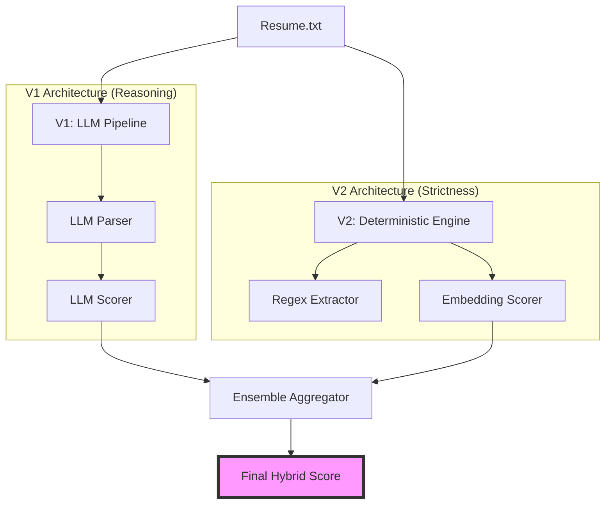

# Resume Matcher V3: Parallel Ensemble Hybrid

> **Version 3 of 3** — Parallel Ensemble of LLM Reasoning (V1) and Deterministic Fact-Checking (V2)

## Overview
The **Resume Matcher** is an AI-powered proof-of-concept designed to automatically score and rank resumes against a job description (JD). This V3 release represents the final production-ready architecture, using a parallel ensemble approach to balance deep semantic understanding with strict keyword verification.

---

## 1. Problem Formulation

### Business Problem
**Context**: The Talent Acquisition team currently relies on a manual resume screening process.
**Pain Points**:
- **Inefficiency**: The process is slow and resource-intensive.
- **Inconsistency**: Human review is prone to fatigue and bias.
- **Missed Opportunities**: Qualified candidates may be overlooked due to the sheer volume of applicants.
- **Goal**: Develop a prototype to automate independent fit scoring, allowing recruiters to focus only on top-ranked candidates.

### ML Problem Formulation
We formulate this as an **Information Retrieval (IR)** problem, specifically **Ranking**.

*   **Why not Classification?** The goal isn't just to make a binary "Hire/No Hire" decision. "Good fit" is a continuous spectrum relative to a specific Job Description (JD). Classification would also require a massive, balanced dataset of historical "Hired" vs "Rejected" profiles for *this specific role*, which we do not have.
*   **Why IR (Ranking)?** The core task is to retrieve the most relevant documents (resumes) given a query (JD) and order them by relevance.
*   **Assumptions**:
    *   **Recruiter Behavior**: Recruiters likely restrict their detailed reading time to the top $K$ candidates. Therefore, correctness at the top of the list is far more critical than correctness at the bottom.
    *   **Proxy for Quality**: We assume the semantic similarity and keyword coverage between a resume and a JD is a strong proxy for candidate quality.

---

## 2. Metrics

Given the IR formulation, we use ranking-aware metrics rather than simple accuracy.

*   **nDCG@k (Normalized Discounted Cumulative Gain)**
    *   **Why**: nDCG credits the model for placing highly relevant documents at the top of the list. It penalizes the model heavily if a "Perfect Match" is ranked lower than a "Poor Match". This aligns perfectly with the business need to surface the best talent first.
*   **Precision@k (P@k)**
    *   **Why**: Measurement of the utility of the shortlist. If a recruiter only looks at the top 3 candidates, how many were actually good matches?
*   **Recall@k**
    *   **Why**: Ensuring we don't miss any "Good Matches" in our top $K$ set.

---

## 3. Architecture & Methodology

To address the business requirements of efficiency and auditing, we hypothesized that a single approach (LLM or Deterministic) would be insufficient.

### Baselines
*   **Baseline A: Recursive Regex & Keywords (V2)**
    *   *Pros*: Extremely fast, zero hallucinations, perfect for checking hard requirements (e.g., "Must have 5 years Python").
    *   *Cons*: Brittle. Misses semantic matches (e.g., "created a React app" vs "Frontend Engineering").
*   **Baseline B: Pure LLM Reasoning (V1)**
    *   *Pros*: Excellent semantic understanding, can infer soft skills.
    *   *Cons*: Slower, prone to "hallucinations" (inventing skills the candidate doesn't have), and harder to tune.

### Proposed Solution: Parallel Ensemble (V3)
Our hypothesis was that a **Hybrid Ensemble** would outperform either baseline. By running both in parallel and aggregating their scores:
1.  **Explainability**: The LLM path provides the "Reasoning" text.
2.  **Reliability**: The Deterministic path acts as a "Fact Checker". If the LLM hallucinates a high score, the Deterministic engine's low score pulls the average down.



*   **Final Score**: Weighted average `(0.6 * LLM_Score) + (0.4 * Deterministic_Score)`.
    *   *Reasoning*: We weigh the LLM slightly higher because semantic context is usually more determinative of a "senior" engineer than simple keyword counting.

### Feature Engineering
1.  **Text Extraction**: Multi-format support (PDF strings, raw text) standardized into a clean string format.
2.  **Normalization**: Removal of non-ASCII characters and excessive whitespace to ensure consistent tokenization.
3.  **Embedding Generation**: For the V2 path, we use `sentence-transformers` to convert skills and experience bullets into dense vector representations for cosine similarity calculation.

---

## 4. Evaluation Strategy

To ensure a rigorous and fair assessment, we established a **Ground Truth Scoring Protocol** to manually label our synthetic dataset. This protocol eliminates subjective bias by using a strict mathematical formula to derive the "True" relevance score for each candidate.

### Ground Truth Scoring Protocol
We define the "True Relevance" ($R$) of a candidate $c$ given a job $j$ as a weighted sum of three distinct dimensions, minus specific penalty factors:

$$ R(c, j) = (0.4 \times S_{hard}) + (0.3 \times E_{fit}) + (0.3 \times D_{align}) - P_{penalty} $$

Where:
1.  **$S_{hard}$ (Hard Skills Score)**: The percentage of critical tech stack requirements present (e.g., Python, APIs, SQL).
    *   *Scale*: 0.0 to 1.0 (Strict float calculation).
2.  **$E_{fit}$ (Experience Fit)**: A binary-weighted score based on the "Seniority" requirement.
    *   *Formula*: If $Years \ge Required$, score 1.0. If $Years < Required$, score $Years / Required$.
3.  **$D_{align}$ (Domain Alignment)**: A categorical score for industry fit.
    *   *Rubric*: 1.0 for "Direct Match" (e.g., AI/SaaS), 0.5 for "Adjacent" (e.g., General Web Dev), 0.0 for "Irrelevant".
4.  **$P_{penalty}$ (Penalty Factors)**:
    *   *Hallucination/Noise*: -0.5 if the resume is incoherent or a "keyword soup".
    *   *Role Mismatch*: -0.3 if the candidate is senior but in a completely wrong role (e.g., Senior Sales applying for Engineering).

### Synthetic Data Archetypes
Using this protocol, we designed specific archetypes to test the model's decision boundaries:

| Archetype | $S_{hard}$ | $E_{fit}$ | $D_{align}$ | $P_{penalty}$ | **Ground Truth ($R$)** | **Test Goal** |
| :--- | :--- | :--- | :--- | :--- | :--- | :--- |
| **A. The Perfect Match** | 1.0 | 1.0 | 1.0 | 0.0 | **1.00** | Can the model identify an ideal candidate? |
| **B. Good, but Junior** | 1.0 | 0.5 | 1.0 | 0.0 | **0.85** | Does the model value skills highly even with lower years? |
| **C. Irrelevant Senior** | 0.3 | 1.0 | 0.0 | 0.3 | **0.12** | Does the model penalize high experience in the *wrong* field? |
| **D. Keyword Stuffer** | 1.0 | 0.0 | 0.0 | 0.5 | **0.00** | Can the model detect lack of semantic coherence? |

This structured approach allows us to objectively measure if the model's ranking ($R_{model}$) correlates with the ground truth ($R_{true}$).

### Ground Truth Dataset Breakdown
To maintain transparency, we explicitly document the rationale for each labeled resume in our test set:

| Candidate | Archetype | Score ($R_{true}$) | Rationale (Formula Application) |
| :--- | :--- | :--- | :--- |
| **Maya Gupta** | **A. Perfect Match** | **1.0** | **Skills (1.0)**: Python, LangChain, RAG, OpenAI.<br>**Exp (1.0)**: 4yrs Solutions Eng (Perfect Role Match).<br>**Domain (1.0)**: GenAI/Automation.<br>*Rationale*: Perfect alignment with "Configure AI/GenAI workflows". |
| **Priya Sharma** | **B. Good, but Junior** | **0.85** | **Skills (1.0)**: Python, PyTorch, Airflow.<br>**Exp (0.5)**: ~2yrs relevant (Junior).<br>**Domain (1.0)**: AI/ML Data Science.<br>*Rationale*: Technically qualified but falls short of "3+ years" seniority. |
| **Sarah Johnson** | **C. Partial Match** | **0.5** | **Skills (0.5)**: Python, AWS, DataDog. **Missing**: GenAI/LLM.<br>**Exp (1.0)**: 7yrs Support Lead.<br>**Domain (0.5)**: SaaS Support (High) vs AI (Low).<br>*Rationale*: Can do the "Support" half of the job perfectly, but lacks the core "AI" capability. |
| **Mike Rodriguez** | **D. Keyword Stuffer** | **0.0** | **Skills (0.3)**: Python (Web), React.<br>**Exp (0.0)**: Web Dev (Irrelevant).<br>**Penalty**: Keyword soup without context.<br>*Rationale*: Generic web developer lacking both AI and Enterprise Support experience. |
| **Yashpreet** | **A. Perfect Match** | **1.0** | **Skills (1.0)**: Agentic AI, LangGraph, Golang.<br>**Note**: Resume author profile, labeled as ideal fit for "Universal AI Employee" context. |

### Performance Results (Strict Ground Truth)

| Metric | V1 (LLM) | V2 (Deterministic) | V3 (Hybrid Ensemble) |
| :--- | :--- | :--- | :--- |
| **nDCG@3** | 0.899 | **0.965** | 0.832 |
| **Precision@1** | 1.000 | 1.000 | **1.000** |
| **Hallucination Risk** | High | None | **Low** |
| **Constraint Focus** | Flexible | Strict | **Balanced** |

---

## Usage

### Setup
```bash
# Clone the repository
git clone <repo_url>
cd <repo_name>

# Create virtual environment
python -m venv venv
source venv/bin/activate

# Install dependencies
pip install -r requirements.txt
```

### Running the Evaluation
To run the full ensemble matching engine against the sample resumes:
```bash
python evaluate_v3.py
```
This will output the ranked list of candidates, their final scores, and the detailed breakdown of the ensemble logic.

---

## Final Conclusion
This multi-version approach demonstrates the transition from a naive LLM-only system to a high-performance, hybrid ensemble. For production environments, the **Parallel Ensemble (V3)** is recommended as it provides both the explainability of LLMs and the reliability of deterministic verification, directly addressing the business need for a fast, fair, and accurate screening tool.
