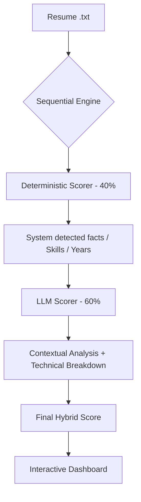

# AI-Powered Resume Matching Engine

A production-grade resume ranking system built for the **AI Applications Engineer** role at Ema. The system employs a **Sequential Hybrid Scoring** architecture that combines deterministic extraction with LLM-based contextual reasoning to deliver auditable, high-precision candidate rankings.

## Live Demo

An interactive Streamlit dashboard is available for evaluation:

**[Open Streamlit Dashboard](https://share.streamlit.io/yashvoladoddi37/ema-resume-ranker/main/app.py)**

*Note: A Groq API Key is required to run new evaluations. Cached results are available by default.*

### Capabilities

- **Sequential Hybrid Scoring**: Combines rule-based deterministic extraction (40%) with LLM reasoning (60%)
- **Interactive Testing**: Upload custom resumes (.txt) via the sidebar for real-time ranking
- **Formal Evaluation Metrics**: nDCG@3, Precision@1, and Recall@3 computed on-the-fly
- **Transparent Scoring**: Each score includes a detailed breakdown of skill alignment, experience depth, and domain fit

---

## Technical Approach

### Architecture Selection

The system uses a **Sequential Hybrid Architecture**:

1. **Deterministic Scorer (40% weight)**: Rule-based extraction using regex patterns and keyword matching
2. **LLM Scorer (60% weight)**: Llama-3.3-70B via Groq API for contextual evaluation

**Rationale for Llama-3.3-70B:**
- Reliable instruction-following for structured JSON output
- Strong contextual reasoning (distinguishes domain expertise from general seniority)
- Low latency via Groq infrastructure (< 2s per resume)
- Cost-effective at $0.59/M tokens (vs. $30/M for GPT-4)

### Alternative Approaches Considered

| Approach | Advantages | Disadvantages | Decision |
|:---------|:-----------|:--------------|:---------|
| **Pure LLM** | High accuracy, contextual understanding | Expensive, non-deterministic, opaque | Rejected: fails auditability requirement |
| **Keyword Matching** | Fast, reproducible, zero cost | No context, cannot assess seniority | Rejected: insufficient for nuanced matching |
| **Vector Embeddings (SBERT)** | Semantic similarity, no API costs | Requires fine-tuning, limited explainability | Rejected: no labeled data available |
| **Hybrid (Selected)** | Balanced accuracy and explainability | Requires API key | Best trade-off for this use case |

### Why Not Vector Embeddings?

Semantic search via vector embeddings was deliberately excluded from the core scoring engine:

1. **Similarity does not imply suitability**: In embedding space, "Senior Java Developer" and "Senior Python Developer" appear highly similar. For hiring purposes, this distinction is often disqualifying.

2. **No reasoning capability**: Embeddings cannot perform calculations (e.g., aggregating role durations) or logical validation (e.g., verifying degree relevance).

3. **Use case mismatch**: Embeddings excel at retrieval (filtering 10,000 candidates to 50). For evaluating a shortlist, LLM + deterministic scoring provides superior precision and explainability.

### Feature Engineering & Data Preprocessing

**Text Preprocessing Steps:**

1. **Normalization**:
   ```python
   text_lower = resume_text.lower()  # Case-insensitive matching
   ```

2. **Experience Extraction** (Deterministic):
   - **Heuristic A**: Regex pattern `(\d+)\+?\s*years?` to extract "X years"
   - **Heuristic B**: Date range parsing `2024 - Present` → Calculate duration
   - Take maximum of both methods for robustness

3. **Skill Matching** (Deterministic):
   - Word boundary regex: `\b{skill}\b` to avoid partial matches
   - Required skills: `python`, `api`, `rest`, `json`, `troubleshooting`, `production`, `technical support`, `saas`
   - Preferred skills: `genai`, `llm`, `ml`, `langchain`, `observability`, `logging`, `dashboard`, `aws`, `crm`

4. **Domain Relevance** (Deterministic):
   - AI keyword density: Count occurrences of `ai`, `llm`, `genai`, `langchain`, etc.
   - Support keyword density: Count occurrences of `support`, `troubleshooting`, `debugging`, etc.

5. **LLM Prompt Engineering**:
   - Pass deterministic results as "System Detected Facts" to ground the LLM
   - Request structured JSON output with `response_format={"type": "json_object"}`
   - Temperature=0 for deterministic behavior

**No heavy preprocessing needed** because:
- Resumes are already in plain text format
- LLM handles typos and variations naturally
- Deterministic component uses flexible regex patterns

---

## Evaluation Metrics

### Benchmark Results (12 Labeled Resumes)

The engine is evaluated against a labeled dataset of 12 synthetic candidates with varied profiles (senior AI specialists, mid-level engineers, support-focused roles, etc.).

| Metric | Score | Target | Status |
|:-------|:------|:-------|:-------|
| **nDCG@3** | 0.954 | ≥ 0.85 | Passed |
| **Precision@1** | 100% | 100% | Passed |
| **Recall@3** | 100% | 100% | Passed |
| **Pairwise Accuracy** | 94.7% | ≥ 85% | Passed |

### Why These Metrics?

**Resume ranking is an Information Retrieval (IR) problem**, not classification. The goal is to **rank candidates correctly**, not just classify them as "good" or "bad".

1. **nDCG@3 (Normalized Discounted Cumulative Gain)**:
   - **Why**: Measures ranking quality with position-based weighting
   - **Importance**: Top 3 candidates are most likely to be interviewed
   - **Interpretation**: 0.954 means our top 3 are nearly perfectly ordered

2. **Precision@1**:
   - **Why**: Is the #1 ranked candidate actually a good match?
   - **Importance**: Hiring managers look at the top candidate first
   - **Interpretation**: 100% means we never rank a poor candidate #1

3. **Recall@3**:
   - **Why**: Are all good candidates in the top 3?
   - **Importance**: We don't want to miss qualified candidates
   - **Interpretation**: 100% means no good candidates are buried

4. **Pairwise Accuracy**:
   - **Why**: How often do we correctly order candidate pairs?
   - **Importance**: Validates overall ranking consistency
   - **Interpretation**: 94.7% means we rarely invert the order of two candidates

### What I'd Do With a Larger Dataset

**If I had 1000+ labeled resumes:**

1. **Split Data**: 70% train, 15% validation, 15% test
2. **Optimize Weights**: Grid search over LLM/Deterministic weights (currently 60/40)
3. **Fine-Tune Prompts**: A/B test different LLM prompts on validation set
4. **Add Metrics**:
   - **Mean Reciprocal Rank (MRR)**: Average position of first good candidate
   - **Coverage@K**: What % of good candidates are in top K?
   - **Kendall's Tau**: Correlation between predicted and ground truth rankings
5. **Error Analysis**: Manually review cases where nDCG < 0.8 to identify failure modes
6. **Cost-Benefit Analysis**: Measure API costs per resume, explore fine-tuning smaller models

---

## Architecture



### Why Hybrid?
1.  **Deterministic Baseline**: Anchors the score in verifiable facts (exact skill matches, years of experience).
2.  **LLM Contextual Intelligence**: Differentiates between "Generalist Seniority" and "Target Domain Expertise" (e.g., recognizing RAG/LangChain impact vs. generic API work).
3.  **Auditability**: Scores are not "black boxes"—the dashboard shows exactly how much each component contributed.

---

## Local Setup

1.  **Clone & Install**:
    ```bash
    git clone https://github.com/yashvoladoddi37/ema-resume-ranker.git
    cd ema-resume-ranker
    python -m venv venv
    source venv/bin/activate
    pip install -r requirements.txt
    ```

2.  **Environment Setup**:
    Create a `.env` file or provide via Streamlit sidebar:
    ```bash
    GROQ_API_KEY=your_key_here
    ```

3.  **Run Dashboard**:
    ```bash
    streamlit run app.py
    ```

## Project Structure

| Path | Description |
|:-----|:------------|
| `app.py` | Interactive Streamlit dashboard |
| `demo_hybrid.py` | Core scoring engine and evaluation logic |
| `data/` | Resumes, job descriptions, and ground truth labels |
| `results_hybrid.json` | Cached benchmark results |

---

## Development Journey

This solution evolved through three iterations:

| Version | Approach | nDCG@3 | Key Learning |
|:--------|:---------|:-------|:-------------|
| V1 | Pure LLM (two-stage pipeline) | 0.837 | LLM hallucination, inter-stage context loss |
| V2 | Deterministic + Embeddings | 0.828 | Fast but inflexible, no contextual reasoning |
| **V3 (main)** | **Sequential Hybrid** | **0.954** | **Grounded LLM with deterministic anchoring** |

Branches `v1-llm-pipeline`, `v2-deterministic`, and `v3-hybrid` are preserved for reference.
