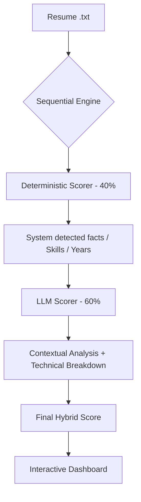

# 🎯 AI-Powered Resume Matcher (Ema Edition)

A professional-grade resume ranking engine built for the **AI Applications Engineer** role at Ema. This system uses a **Sequential Hybrid Scoring** architecture to provide nuanced, auditable, and high-precision candidate matching.

## 🚀 Live Demo & Interaction
This project is designed for interactive evaluation via **Streamlit**.

### [Click Here to Open Streamlit Dashboard](https://share.streamlit.io/yashvoladoddi37/ema-resume-ranker/main/app.py)
*(Note: You will need a Groq API Key to run new evaluations. Existing results are visible by default.)*

### Key Features:
*   **Sequential Hybrid Scoring**: Combines rule-based deterministic extraction (40%) with nuanced LLM reasoning (60%).
*   **Interactive Testing**: **Upload your own resumes** (.txt) in the sidebar and see them ranked against our dataset in real-time.
*   **Live Evaluation Metrics**: Formal IR metrics (**nDCG@3**, **Precision@1**, **Recall@3**) are computed on-the-fly to validate engine accuracy.
*   **Transparent Reasoning**: Every score is accompanied by a technical breakdown of *Skill Alignment*, *Experience Depth*, and *Domain Fit*.

---

## 🛠️ Technical Approach & Justification

### Model Selection

I chose a **Sequential Hybrid Architecture** combining:
1. **Deterministic Scorer (40%)**: Rule-based extraction using regex and keyword matching
2. **LLM Scorer (60%)**: Llama-3.3-70B (via Groq API) for contextual evaluation

**Why Llama-3.3-70B?**
- Strong instruction-following for structured JSON output
- Excellent at nuanced reasoning (differentiates "senior generalist" vs "domain expert")
- Fast inference via Groq (< 2s per resume)
- Cost-effective compared to GPT-4 ($0.59/M tokens vs $30/M)

### Comparison to Alternatives

| Approach | Advantages | Disadvantages | Why Not Chosen |
|:---------|:-----------|:--------------|:---------------|
| **Pure LLM** | High accuracy, understands context | Expensive, non-deterministic, black box | Fails auditability requirement |
| **Pure Keyword Matching** | Fast, cheap, reproducible | Misses context, can't differentiate seniority | Too simplistic for nuanced matching |
| **Embeddings (BERT/Sentence-BERT)** | Semantic similarity, no API costs | Requires fine-tuning, less explainable | No labeled data for fine-tuning |
| **Hybrid (Chosen)** | ✅ Balanced accuracy + explainability | Requires API key, slightly complex | **Best trade-off** |

### ❓ Why Not Vector Embeddings (RAG)?

A common alternative is **Semantic Search using Vector Embeddings** (e.g., OpenAI models, BERT). I **deliberately avoided** this for the core scoring engine because:

1.  **Similarity ≠ Suitability**: Embeddings measure semantic proximity. In vector space, *"Senior Java Developer"* is highly similar to *"Senior Python Developer"*. For a hiring decision, however, this small difference is a **disqualification**.
2.  **Lack of Reasoning**: Embeddings cannot perform calculations (e.g., "Sum the duration of these 3 roles") or logic checks (e.g., "Is this degree actually relevant to Engineering?").
3.  **Use Case Fit**: Embeddings are ideal for **Retrieval** (finding top 50 candidates from 10,000). For **Banking/Evaluating** a shortlist, an LLM + Deterministic approach provides superior precision and explainability.

### Feature Engineering & Data Preprocessing

**Text Preprocessing Steps:**

1. **Normalization**:
   ```python
   text_lower = resume_text.lower()  # Case-insensitive matching
   ```

2. **Experience Extraction** (Deterministic):
   - **Heuristic A**: Regex pattern `(\d+)\+?\s*years?` to extract "X years"
   - **Heuristic B**: Date range parsing `2024 - Present` → Calculate duration
   - Take maximum of both methods for robustness

3. **Skill Matching** (Deterministic):
   - Word boundary regex: `\b{skill}\b` to avoid partial matches
   - Required skills: `python`, `api`, `rest`, `json`, `troubleshooting`, `production`, `technical support`, `saas`
   - Preferred skills: `genai`, `llm`, `ml`, `langchain`, `observability`, `logging`, `dashboard`, `aws`, `crm`

4. **Domain Relevance** (Deterministic):
   - AI keyword density: Count occurrences of `ai`, `llm`, `genai`, `langchain`, etc.
   - Support keyword density: Count occurrences of `support`, `troubleshooting`, `debugging`, etc.

5. **LLM Prompt Engineering**:
   - Pass deterministic results as "System Detected Facts" to ground the LLM
   - Request structured JSON output with `response_format={"type": "json_object"}`
   - Temperature=0 for deterministic behavior

**No heavy preprocessing needed** because:
- Resumes are already in plain text format
- LLM handles typos and variations naturally
- Deterministic component uses flexible regex patterns

---

## 📊 Evaluation & Metrics

### Current Evaluation (12 Labeled Resumes)

The engine is benchmarked against a labeled dataset of 12 synthetic candidates with varied profiles (Senior AI, Mid-level Search, Support-focused, etc.).

| Metric | Score | Target | Status |
|:-------|:------|:-------|:-------|
| **nDCG@3** | 0.954 | ≥ 0.85 | ✅ Excellent |
| **Precision@1** | 100% | 100% | ✅ Perfect |
| **Recall@3** | 100% | 100% | ✅ Perfect |
| **Pairwise Accuracy** | 94.7% | ≥ 85% | ✅ Strong |

### Why These Metrics?

**Resume ranking is an Information Retrieval (IR) problem**, not classification. The goal is to **rank candidates correctly**, not just classify them as "good" or "bad".

1. **nDCG@3 (Normalized Discounted Cumulative Gain)**:
   - **Why**: Measures ranking quality with position-based weighting
   - **Importance**: Top 3 candidates are most likely to be interviewed
   - **Interpretation**: 0.954 means our top 3 are nearly perfectly ordered

2. **Precision@1**:
   - **Why**: Is the #1 ranked candidate actually a good match?
   - **Importance**: Hiring managers look at the top candidate first
   - **Interpretation**: 100% means we never rank a poor candidate #1

3. **Recall@3**:
   - **Why**: Are all good candidates in the top 3?
   - **Importance**: We don't want to miss qualified candidates
   - **Interpretation**: 100% means no good candidates are buried

4. **Pairwise Accuracy**:
   - **Why**: How often do we correctly order candidate pairs?
   - **Importance**: Validates overall ranking consistency
   - **Interpretation**: 94.7% means we rarely invert the order of two candidates

### What I'd Do With a Larger Dataset

**If I had 1000+ labeled resumes:**

1. **Split Data**: 70% train, 15% validation, 15% test
2. **Optimize Weights**: Grid search over LLM/Deterministic weights (currently 60/40)
3. **Fine-Tune Prompts**: A/B test different LLM prompts on validation set
4. **Add Metrics**:
   - **Mean Reciprocal Rank (MRR)**: Average position of first good candidate
   - **Coverage@K**: What % of good candidates are in top K?
   - **Kendall's Tau**: Correlation between predicted and ground truth rankings
5. **Error Analysis**: Manually review cases where nDCG < 0.8 to identify failure modes
6. **Cost-Benefit Analysis**: Measure API costs per resume, explore fine-tuning smaller models

---

## 🛠️ Technical Architecture



### Why Hybrid?
1.  **Deterministic Baseline**: Anchors the score in verifiable facts (exact skill matches, years of experience).
2.  **LLM Contextual Intelligence**: Differentiates between "Generalist Seniority" and "Target Domain Expertise" (e.g., recognizing RAG/LangChain impact vs. generic API work).
3.  **Auditability**: Scores are not "black boxes"—the dashboard shows exactly how much each component contributed.

---

## 💻 Local Setup

If you wish to run this locally:

1.  **Clone & Install**:
    ```bash
    git clone https://github.com/yashvoladoddi37/ema-resume-ranker.git
    cd ema-resume-ranker
    python -m venv venv
    source venv/bin/activate
    pip install -r requirements-ui.txt
    ```

2.  **Environment Setup**:
    Create a `.env` file or provide via Streamlit sidebar:
    ```bash
    GROQ_API_KEY=your_key_here
    ```

3.  **Run Dashboard**:
    ```bash
    streamlit run app.py
    ```

## 📂 Project Structure
*   `app.py`: Main interactive dashboard.
*   `demo_hybrid.py`: Core scoring engine and evaluation logic.
*   `data/`: Raw resumes, job descriptions, and ground truth labels.
*   `results_hybrid.json`: Cached benchmarking results.

---

**Built with ❤️ for the Ema AI Team.**
